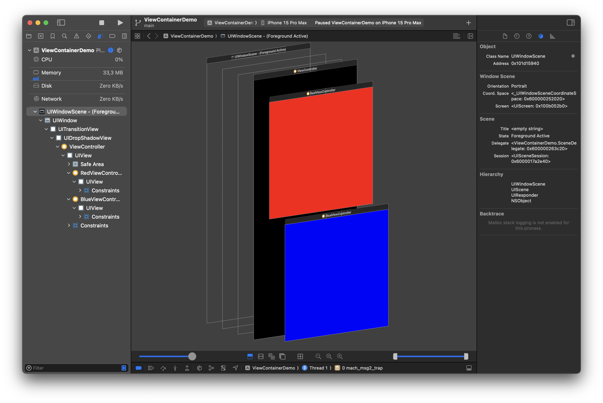

#  View Controller Container Demo

This is a demonstration of a container view controller as contemplated in https://stackoverflow.com/questions/78050537/adding-two-uiview-vertically

I clicked on the “debug view hierarchy” button and this is what I saw:

- - -

## Build configuration

Built in Xcode 15.2 and Swift 5.9.2.

- - -

## License

24 February 2024

Copyright © 2024 Robert M. Ryan. All Rights Reserved.

See [License](LICENSE.md).
